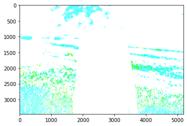
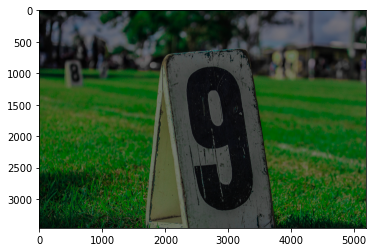
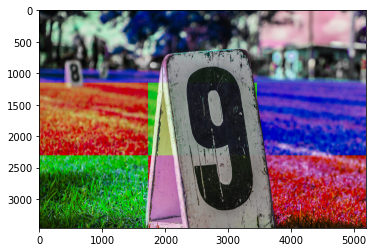
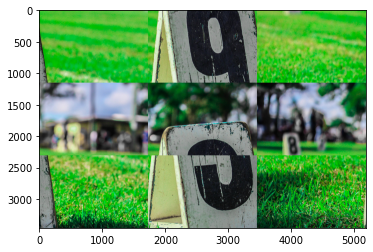

# Table of Contents
* [Chapter 1-1: Image Processing and Visualization (pp.224-256)](#chapter-1-1-image-processing-and-visualization)
* [Chapter 1-2: Audio Processing and Visualization](#chapter-1-2-audio-processing-and-visualization)
* [Chapter 1-3: Preprocessing for Machine Learning](#chapter-1-3-preprocessing-for-machine-learning)
* [Chapter 2-1: Image Classification with Transfer Learning and Fine Tuning](#chapter-2-1-image-classification-with-transfer-learning-and-fine-tuning)

# Textbook 
* 下山 輝昌、伊藤 淳二、露木 宏志 著「Python実践 データ加工/可視化 100本ノック」(秀和システム)

# GitHub Repo
* [2022-sem1-rinko](https://github.com/kiyalab-tmu/2022-sem1-rinko)

# Chapter 1-1: Image Processing and Visualization 

### Q.1: Image display (ノック61)
Load an image using cv2.imread and show it. 

### Q.2: Contents of image data (ノック62)
Check out the shape of an image and pixel values in the blue channel. 

### Q.3: Image cropping (ノック63)
Crop an image between (700,300) and (1200,800). 

### Q.4: Color histogram visualization (ノック64)
Visualize the color histogram of an image using cv2.calcHist. 

### Q.5: RGB transformation (ノック65)
Change the channel order from RGB -> BGR using cv2.cvtColor. 

### Q.6: Image data type
The following script was written to make an image underexposed. 
```
img_dim = img_rgb * 0.5
plt.imshow(img_dim)
```
However, the result seems strange:



Please figure out why the problem has occurred, and modify the script to achieve the desired result:



### Q.7: Color scrambling
1. Take a photo using your smartphone.
2. Implement color scrambling.
3. Apply color scrambling to the photo.
* Any block size can be used.



### Q.8: Image resizing (ノック66)
* Upsample and downsample an image.
* Try various interpolation methods and compare the results.

### Q.9: Image rotation (ノック67)
* Rotate an image.
* Flip an image (both horizontal and vertical).

### Q.10: Image processing (ノック68)
* Convert a color image to a grayscale one.
* Binarize an image.
* Apply a smoothing filter to an image (use cv2.bulr).

### Q.11: Drawing line or text in image (ノック69)
* Draw a text on an image.
* Draw a rectangle on an image.

### Q.12: Image save (ノック70)
* Save an image using cv2.imwrite

### Q.13: Block scrambling
1. Take a photo using your smartphone.
2. Implement block scrambling.
3. Apply block scrambling to your photo.



### Q.14: Fast color space transform
* Load an RGB image and transform its color space to YCbCr.
* **Processing time limitation is within 4 second.**
* Color space transform equations are
```
Y  =  0.29900 * R +  0.58700 * G +  0.11400 * B
Cb = -0.16874 * R + -0.33126 * G +  0.50000 * B
Cr =  0.50000 * R + -0.41869 * G + -0.08100 * B
```
* TIPS: np.reshape and matrix multiplication would be helpful.

# Chapter 1-2: Audio Processing and Visualization

* HOMEに課題を解くための雛形をアップロードしましたので下記の手順からダウンロードしてください
1. `git pull`
2. `git checkout main`
3. HOMEディレクトリに、新しいChapができてるので，そこから必要なファイルをコピー（自分のマシンのデスクトップなどに一時的にペースト）
4. `git checkout 自分のブランチ名`で自分のブランチにもどる
5. デスクトップなどに一時的にペーストしたファイルを自分の作業ディレクトリにコピペ
* 発表では、**音声がzoomで聞けるように工夫をお願いします**
* ２つの音声を比較するときは，立て続けに再生して比較するようにしましょう（２つの音声再生の間に，話したりしないようにしましょう）

### Q.1 音データを再生してみよう & 音データを読み込んでみよう（ノック71&72）
* librosaを使用して"音声.mp3"と"携帯電話着信音.mp3"を読み込んでください（ノック72）
* "音声.mp3"と"携帯電話着信音.mp3"を再生してください（ノック71）
* vscode+jupyter環境では音源を再生できないので注意してください（ノック71）
* 音源ファイルのサンプリングレートを確認してください（ノック72）
* ロードした音源を配列に格納し、shape/max/minを確認してください（ノック72）

### Q.2 音データの一部を取得してみよう（ノック73）
* "音声.mp3"と"携帯電話着信音.mp3"を1秒間のデータに切り出してください
* 編集したファイルを再生してみましょう

### Q.3 音データのサンプリングレートを変えてみよう（ノック74）
* サンプリングレートとは何かを説明してください
* サンプリングレートを22050Hzにして"音声.mp3"と"携帯電話着信音.mp3"を読み込んで再生してみましょう
* サンプリングレートを8000Hzも読み込んで再生してみましょう
* サンプリングレートを変更したら，配列の形状を確認してみよう
* getsamplerate()で元のファイルのサンプリングレートを表示してみよう

### Q.4 音データを可視化してみよう（ノック75）
* librosa.display.waveshowを使って，"音声.mp3"の音声波形を可視化してみましょう（44100/22050/8000Hzそれぞれ可視化してください）
* "携帯電話着信音.mp3"の音源波形を確認してみましょう（44100HzのみでOK）

### Q.5 音データの大きさを取得してみよう（ノック76）
* RMSとは何かを説明してください
* numpyを使って，"音声.mp3"のデータ全体に対してのRMSを計算してください
* "音声.mp3"と"携帯電話着信音.mp3"の時間別のRMSを算出してください
* "音声.mp3"，"携帯電話着信音.mp3"のRMSデータ（全体・時間別ともに）を可視化してください

### Q.6 音データを保存しよう（ノック80）
* "音声.mp3"を，soundfileを使って，WAV形式で音データを保存してください
* 出力したWAVファイルを再度ロードし，その音を確認してください
* **ノック80なので注意してください**

### Q.7 WAVデータを変換してみよう
* wavデータを読み込んでください（wavデータは，dataフォルダを参照）
* pydubのAudiosegmentを使って，flacおよびmp3で音源ファイルを保存（出力してください）
* wav/flac/mp3について説明してください
* wav/flac/mp3のデータの圧縮率を確認してください
* 圧縮率に違いがあれば，その理由を考察してください

### Q.8 周波数スペクトルを表示してみよう（ノック77）
* フーリエ変換とは何かを説明してください
* "音声.mp3"をフーリエ変換してみましょう
* "音声.mp3"の振幅スペクトルを表示してみましょう
* "音声.mp3"（サンプリングレート22050Hz）の振幅スペクトルを表示してみましょう
* "携帯電話着信音.mp3"の振幅スペクトルを表示してみましょう

### Q.9 スペクトログラムを可視化してみよう（ノック78）
* スペクトログラムとは何かを説明してください
* librosaのライブラリを使って，"音声.mp3"のスペクトログラムを表示してみましょう
* librosaのライブラリを使って，"携帯電話着信音.mp3"のスペクトログラムを表示してみましょう

### Q.10 音の高さや長さを変えてみよう（ノック79）
* librosa.effects.pitch_shiftを使い，"音声.mp3"をピッチのステップ数10で，音を変換してみましょう
* librosa.effects.pitch_shiftを使い，"音声.mp3"をピッチのステップ数-5で，音を変換してみましょう
* librosa.effects.time_stretchを使い，"携帯電話着信音.mp3"をレート数0.5で，音を変換してみましょう
* librosa.effects.time_stretchを使い，"携帯電話着信音.mp3"をレート数2で，音を変換してみましょう

### Q.11 音データを変換してみよう
* VTLNとClippingについて説明してください
* "音声.mp3"を読み込みましょう
* "音声.mp3"にVTLNとClippingを施し，音を再生してみましょう
* VTLNとClippingのパラメータを調節して，結果がどう変わるかを確認してみましょう

# Chapter 1-3: Preprocessing for Machine Learning

* HOMEに課題を解くための雛形をアップロードしましたので下記の手順からダウンロードしてください
1. `git pull`
2. `git checkout main`
3. HOMEディレクトリに、新しいChapができてるので，そこから必要なファイルをコピー（自分のマシンのデスクトップなどに一時的にペースト）
4. `git checkout 自分のブランチ名`で自分のブランチにもどる
5. デスクトップなどに一時的にペーストしたファイルを自分の作業ディレクトリにコピペ

* この章では，タイタニック号の生存状況のデータに基づき，海難事故にあった場合どういった顧客が生存できるのかを予測するモデルを作成します．
### Q.1 機械学習で予測したいデータを分けよう（ノック81）
* seabornのload_datasetを使って，'titanic'のデータセットを読み込みましょう
* 'titanic'のデータセットが，どのようなデータセットなのか簡単に説明してください（各カラムの意味など）
* "目的変数"および"説明変数"とは何かをそれぞれ説明してください
* データセットから，目的変数の列のみを取り出してみましょう

### Q.2 TrainデータとTestデータに分割しよう（ノック82）
* "教師あり学習"と"教師なし学習"とは何かをそれぞれ説明してください（具体的なモデル名が分かればそれを例示してください）
* "Trainデータセット"および"Testデータセット"とは何かをそれぞれ説明してください（"Validationデータセット”など，その他の種類があればそれも説明してください）
* sklearnのtrain_test_splitを使って，データセットをTrainデータ(train_ds)とTestデータ(test_ds)に分割してください
* train_test_splitの仕様（引数など）を簡単に説明してください
* 分割したデータを確認してみましょう

### Q.3 データを機械学習に適した形式へ変換しよう（ノック83）
* 今回のタスクにおける"データリーク"の意味を説明してください（ラベル"survived"とカラム"alive"の関係を例に説明するとよいでしょう）
* 予測モデルを作成するにあたって，必要なデータと不要なデータがそれぞれ何かを説明してください
* dropを用いて，不要な変数名をデータセット(train_ds)から削除しましょう
* "One-hotエンコーディング"および"labelエンコーディング"とは何かをそれぞれ説明してください
* Trainデータセット(train_ds)をone-hotエンコーディングしてみましょう
* Trainデータセット(train_ds)をlabelエンコーディングしてみましょう
* Labelエンコーディングの問題点を挙げてください
* train_dsの"pclass"列をone-hotエンコーディングしてみましょう
* train_dsのTrue/Falseを1/0の数値に変換しましょう

### Q.4 欠損値の処理をやってみよう（ノック88）
* 欠損値とは何かを説明してください
* 欠損値はどのように処理されるのか調べてみましょう（テキスト参照）
* データセット(train_ds)に欠損値がないか確認してください（各カラムごとの欠損値の合計数を確認してください）
* train_dsの欠損値を中央値で補完で補完しましょう
* sklearn.imputeのSimpleImputer使用
* 作成したSimpleImputer(age_imputer)をpickleを用いて保存してください

### Q.5 テストデータの前処理をしよう（ノック90）-パート１-
* Testデータセット(test_ds)の内容を確認しましょう
* Testデータセットの不要な項目を削除しましょう（aliveとembark_town）
* Testデータセットをカテゴリカル変数に変換しましょう
* TestデータセットのTrue/Falseを0/1に変換しましょう
* **今週は、merge関数を用いてTrainデータセットとTestデータセットのカラム違いを解消する必要はありません**
* **今週は、スケーリングを行う必要はありません**
* train_dsの欠損値補完に使用したage_imputerをpickleでロードして、test_dsの欠損値を補完してください（図7-40参照）
* 加工したtest_dsを確認してください

### Q.6 追加課題１: scikit-learn を用いて、モデルを訓練しよう -パート１-
* sklearn.svm.SVCを用いて、モデルを訓練してみましょう
* Trainモデルに対する精度を評価しましょう（モデル名.scoreで評価できるはずです）
* Testモデルに対する精度を評価しましょう
* 今週は，SVMの詳しい説明は不要です（2週間後にまとめて勉強します）

### Q.7 外れ値の検出をしよう（ノック84）
* 外れ値とは何かを説明してください
* 箱ひげとIQRについて簡単に説明してください
* 箱ひげとIQRに基づいて，外れ値に該当するデータの件数を調べましょう

### Q.8 データ分布を見てスケーリング手法を考えよう（ノック85）
* スケーリングとは何か説明してください（特に，正規化・標準化・ロバストスケーリングについて説明してください）
* 正規化・標準化・ロバストスケーリングは，それぞれどのような分布に対して有効なのか説明してください
* train_dsの基本統計量を確認してください
* データ分布の違いをヒストグラムで可視化しましょう
* 統計学の検定（カイ二乗検定とシャピロ-ウィルク検定）について説明してください
* カラムageについて，カイ二乗検定/シャピロ-ウィルク検定のp値を算出してください（さらに，一様性と正規性を判定してください）
* カラムsidspについて，カイ二乗検定/シャピロ-ウィルク検定のp値を算出してください（さらに，一様性と正規性を判定してください）
* カラムparchについて，カイ二乗検定/シャピロ-ウィルク検定のp値を算出してください（さらに，一様性と正規性を判定してください）
* カラムfareについて，カイ二乗検定/シャピロ-ウィルク検定のp値を算出してください（さらに，一様性と正規性を判定してください）

### Q.9 分布に従ってスケーリングをやってみよう（ノック86）
* age，sidsp，parch，fareについて，それぞれどのようなスケーリング手法を行うのが良いか，理由とともに検討してください
* 変数間で分布が同じ場合は，どのようなスケーリングを行うのが良いでしょうか；一方で，変数間で分布が異なる場合は，そのようにスケーリングすれば良いでしょうか（テキストp.306 参照）
* age，sidsp，parch，fareをスケーリングしてください（sklearn.preprocessingにスケーラーがあります）
* スケーリングしたデータの分布をヒストグラムで可視化しましょう

### Q.10 スケーラーを保存しよう（ノック87）
* os.makedirsでフォルダを作成し，スケーラーをpickle形式で保存してください
* スライドでの説明は不要です

### Q.11 学習時のサンプル比率を調整しよう（ノック89）
* 学習時のデータのサンプル比率を調整する必要性について説明してください
* アンダーサンプリングとオーバーサンプリングについて説明してください
* 目的変数のデータ件数を調べてみましょう
* train_dsをアンダーサンプリング/オーバーサンプリングしてください

### Q.12 テストデータの前処理をしよう（ノック90）-パート２-
* Q.5 テストデータの前処理をしよう（ノック90）-パート１-をもう一度行いましょう
* 今週は、カラム違いの解消・スケーリングを**行ってください**
* Pandasのmergeを用いて、TrainデータセットとTestデータセットのカラム違いを解消してください（その原因が分かれば簡単に説明してください）
* カラム解消で用いた、Pandasのmergeについて説明してください（特に、how='left'の部分について）

### Q.13 追加課題２: scikit-learn を用いて、モデルを訓練しよう -パート２-
* SVMとは何か説明してください
* sklearn.svm.SVCを用いて、モデルを訓練してみましょう
* Trainモデルに対する精度を評価しましょう（モデル名.scoreで評価できるはずです）
* Testモデルに対する精度を評価しましょう
* **Q.6 追加課題１の精度と比較してみましょう**

<!---
### Q. 追加課題３: scikit-learn を用いて、色々なモデルを使って学習してみよう
* 線形回帰について説明してください（式・式中の何を学習するのか・最小二乗法との関係性など）
* 回帰と分類の関係性について説明してください（似ているところや違いなども説明してください）
* 生成モデルと識別モデルの違いを説明してください
* パーセプトロン，ロジスティック回帰，SVM（サポートベクトルマシン）についてそれぞれ説明してください
* パーセプトロン・ロジスティック回帰のモデルを使って，Trainモデルに対する精度を評価しましょう
* パーセプトロン・ロジスティック回帰のモデルを使って，Testモデルに対する精度を評価しましょう
-->

# Chapter 2-1: Image Classification with Transfer Learning and Fine Tuning
* 特に指定がない限り、教科書で用いているPytorchのサンプルコードを利用してください
* 「簡単に説明してください」は口頭での説明のみでも構いません
* GPUマシンが混雑している場合は、代表者１〜２名のみが学習を行い、その結果をシェアして発表する形式でも構いません（全員がGPUマシンで学習スクリプトを実行し、精度を出すことを行わなくても良いです）
* 学習スクリプトを回さない人でも、コーディングとエラーがないかのチェックは行いましょう

## 学習済みのVGGモデルを使用する方法(p.2~)

### Q.1 データセット
* ImageNetデータセットについて説明してください（クラス数・訓練データ数・ベンチマークなど）
* データセットと関連が深い、ミニバッチ学習について説明してください（なぜそれをやるとよいのかなど）

### Q.2 パッケージのimportとPytorchのバージョン確認
* この課題で利用するパッケージをimportしてください
* Pytorchのパージョンを確認してください
* スライドの説明はなしで構いません

### Q.3 VGG-16の学習済みモデルのロード
* 畳み込み層・プーリング層・全結合層について説明してください
* Dropout層について説明してください
* 活性化関数とReLUについて説明してください
* VGG-16を説明してください（発表年・モデル構造・解決しようとした主な問題など）
* featureモジュールとclassifierモジュールについて説明してください
* VGG-16の学習済みモデルをロードしてください

### Q.4 入力画像の前処理
* Pythonの`__call__()`メソッドについて簡単に説明してください
* torchvisionの`transform.resize()`、`transform.CenterCrop()`、`transform.ToTensor()`、`transform.Normalize()`についてそれぞれ説明してください
* `transform.ToTensor()`を実行すると、PIL形式の入力画像のサイズ（Shape）はどのように変化するか説明してください
* 上記のメソッドを使って、画像を224x244にリサイズおよびセンタークロップしてください
* 画像の色情報を平均(0.485, 0.456, 0.406)、標準偏差(0.229, 0.224, 0.225)で標準化してください
* なぜこのリサイズと標準化が必要なのか説明してください（ヒント：学習済みモデル）
* `./data/goldenretriever-3724972_640.jpg`を読み込み、前処理を行う前後の画像を比較しましょう

### Q.5 出力結果からラベルを予測する後処理
Q.5~Q.6を通しで実行した後で下記の質問を考えるほうが良いと思います
* VGG16の出力サイズ（shape）とそのデータ型は何でしょうか（Q.6を実行するとわかります）
* VGG16の出力をNumPy型に変換してください
* np.argmax()について説明してください
* ラベルとnp.argmax()の関係について説明してください
* `./data/imagenet_class_index.json`を読み込んで、その中身について簡単に説明してください
* 読み込んだjsonを使って、VGGの出力からラベルを得るクラスを作成してください

### Q.6 学習済みVGGモデルで手元の画像を分類
* unsqueeze_()メソッドを行う理由を説明してください（ヒント：バッチサイズ）
* `./data/goldenretriever-3724972_640.jpg`を分類してみましょう

## Pytorchによるディープラーニング実装の流れ（p.14~)

### Q.7 Pytorchによるディープラーニング実装の流れ
* 図1.2.1 (p.15) を参考に，Pytorchによるディープラーニング実装の流れを説明してください
* ネットワークモデルの順伝搬関数 (forward)とは何かを説明してください
* 損失関数について説明してください（計算方法・損失関数の種類など）
* 誤差逆伝播と最適化手法について説明してください（2つの関係性・最急降下法の式・最適化手法の種類など;ただしSGD,Adamなどの個々の詳解は不要です）
* ネットワークモデルの重み(パラメータ)の初期値は，どのような値であるか説明してください
* 過学習とは何かを説明してください
* Validationデータセットとは何か説明してください（Testデータセットとの違いなど）
* early stoppingとは何かを説明してください（導入の目的など）

## 転移学習の実装（p.17~)

### Q. 転移学習
* 転移学習とは何かを説明してください（ファインチューニングについて調べるとより違いが明確になります）
* 今回のタスクについて説明し、転移学習をどのように適用したかを説明してください

### Q. 実装の初期設定
* 必要なパッケージをimportしてください（説明は不要）
* 乱数のシードとは何か説明してください（特に、機械学習との関係について）

### Q. Datasetを作成
* 前処理クラスImageTransformを作成してください
* データ拡張（オーギュメンターション）とは何かを説明してください
* `RandomResizedCrop`と`RandomHorizontalFlip`について説明してください
* ImageTransformを施した前後の画像を比較してください
* アリとハチの画像へのファイルパスリストを作成し、それらの画像のDatasetを作成してください

### Q. DataLoaderを作成
* 作成したDatasetを使ってDataLoaderを作成してみましょう

### Q. ネットワークモデルを作成
* 学習済みのVGG-16モデルをロードしましょう
* 転移学習を行うために、VGG-16モデルを加工してください

### Q. 損失関数を定義
* softmax関数について説明してください
* Cross Entropy誤差関数について説明してください
* Cross Entropy誤差関数を実装しましょう

### Q. 最適化手法を設定
* Momentum SGDについて説明してください
* 最適化手法を実装しましょう

### Q. 学習・検証を実施
* 転移学習を用いて学習・検証を実行してください
* LossとAccuracyを確認してください

## Amazon AWSのクラウドGPUマシンを使用する方法（p.32~)
* 今回はスキップします。興味のある方は読んでみてください。

## ファインチューニングの実装（p.47~)

### Q. ファインチューニング
* ファインチューニングとは何かを説明してください

### Q. DatasetとDataLoaderを作成
* 転移学習のときと同様に、DatasetとDataLoaderを作成してください（説明は不要）

### Q. ネットワークモデルを作成
* 学習済みのVGG-16モデルをロードしましょう
* ファインチューニングを行うために、VGG-16モデルを加工してください

### Q. 損失関数を定義
* 転移学習のときと同様に、Cross Entropy誤差関数を実装しましょう（説明は不要）

### Q. 最適化手法を設定
今回は、各層ごとに学習率を変更します
* 学習させる層のパラメータ名を指定し、パラメータごとに各リストに格納してください
* 最適化手法を、パラメータごとに設定してください

### Q. 学習・検証を実施
* PytorchでGPUを用いた演算を有効化する方法を説明してください
* ファインチューニングを用いて学習・検証を実行してください
* LossとAccuracyを確認してください

### Q. 学習したネットワークを保存・ロード
* ネットワークモデルの変数`net`からパラメータを取り出し、保存してください
* 保存した重みを、再度ロードしてみましょう（CPU、GPUでそれぞれ計算されたパラメータの違いに注意してください）
